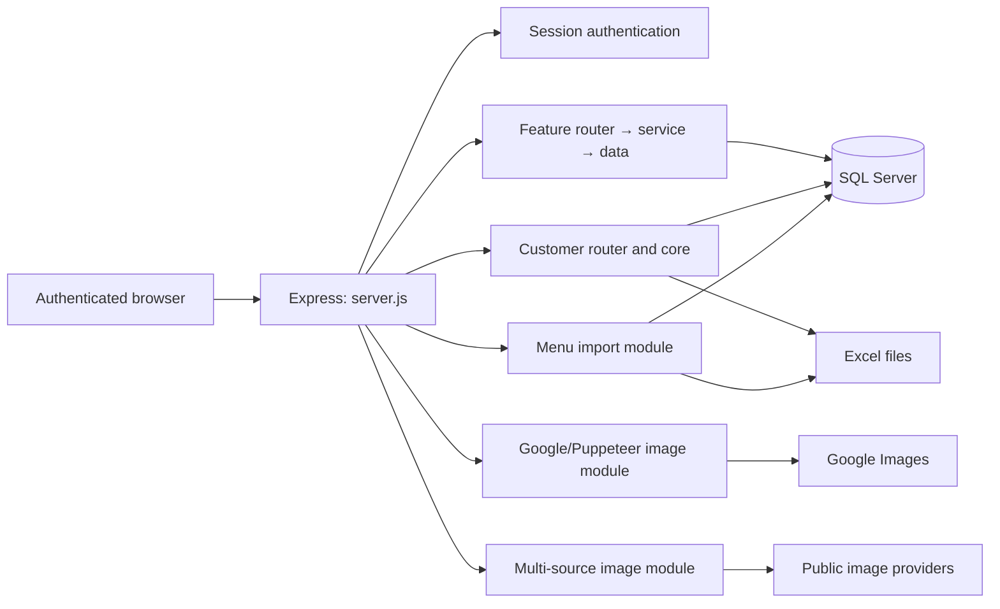
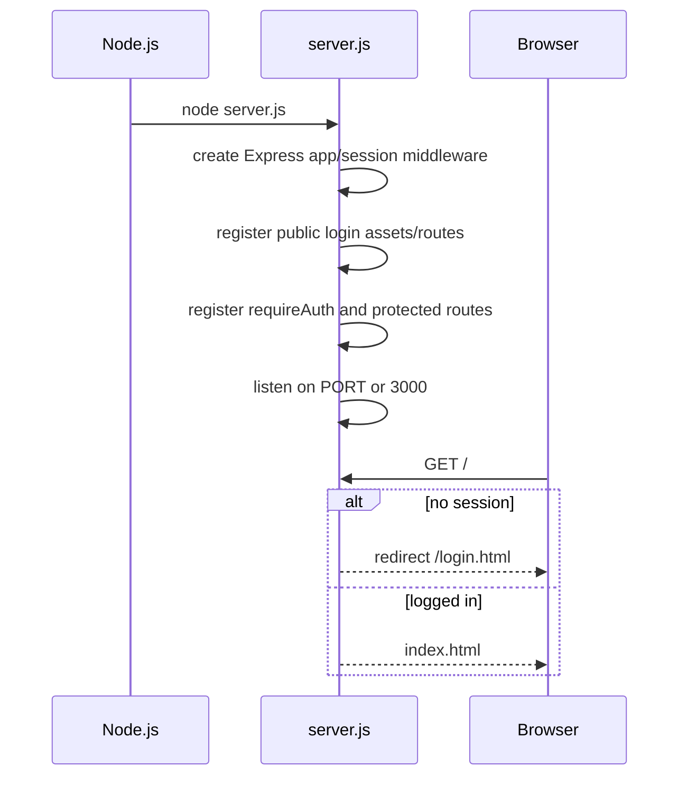
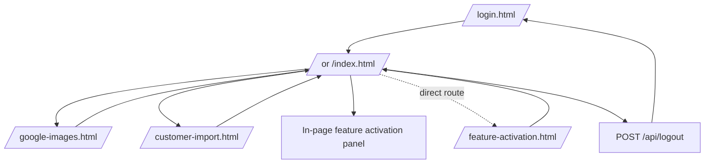
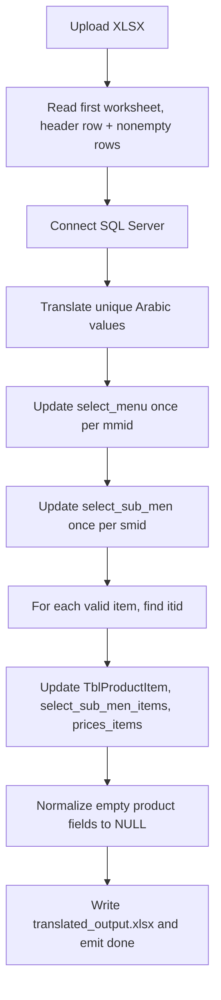
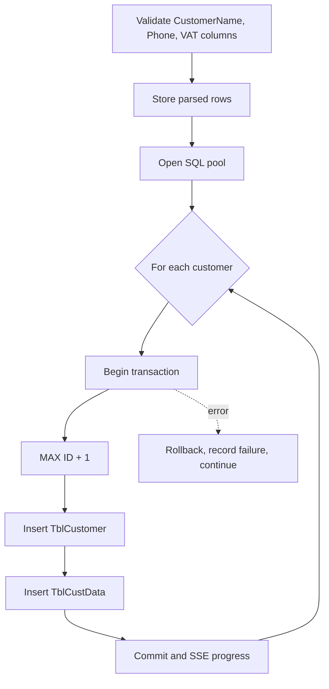
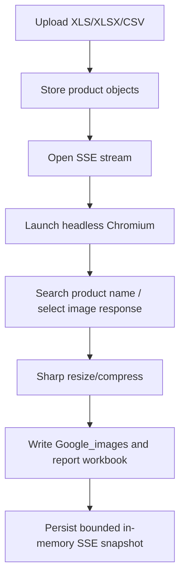
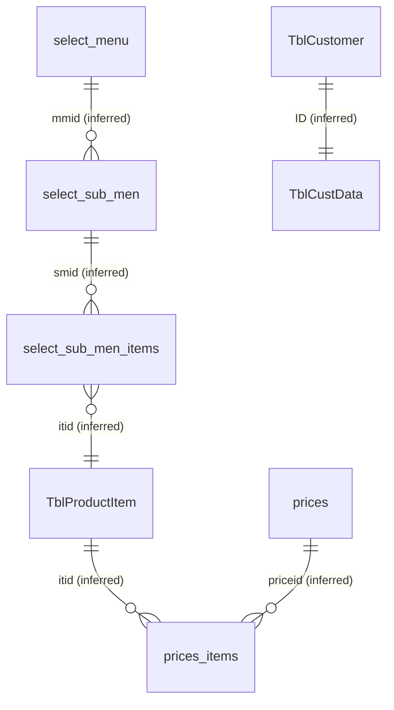
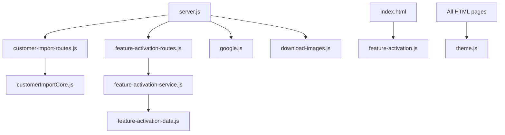

# Project Documentation — SQL Menu Bulk Importer

> **Scope.** This is a source-derived architecture document for the repository at `D:\sql-menu-bulk-importer-development`, inspected on 2026-07-12. It documents what the checked-in source proves. SQL Server schema metadata, deployment topology, and production configuration are **Unknown** where not declared by the project.

## Table of contents

1. [Project overview](#project-overview)
2. [Architecture and startup](#architecture-and-startup)
3. [Folder structure and file inventory](#folder-structure-and-file-inventory)
4. [Pages, navigation, and UI](#pages-navigation-and-ui)
5. [APIs and workflows](#apis-and-workflows)
6. [Database](#database)
7. [Dependencies, call graph, and data flow](#dependencies-call-graph-and-data-flow)
8. [Configuration and assets](#configuration-and-assets)
9. [Security, operations, and maintainability](#security-operations-and-maintainability)

---

# Project overview

## Executive summary

SQL Menu Bulk Importer is a server-rendered, Arabic-first administration tool for an Afaq/RGB SQL Server POS database. A single Express process provides authentication, four browser pages, file upload handling, server-sent event (SSE) progress streams, Excel/CSV exports, customer management, image acquisition, and feature-flag persistence.

The main dashboard imports menu names, item names, translations, and prices into existing ERP/POS tables. Customer import is deliberately isolated from menu-import state. Image work has two implementations: an older multi-provider downloader used by the dashboard, and a Puppeteer Google workflow used by its own page. Feature flags are persisted in a lazily-created `FeatureSettings` table.

There is no build pipeline, test suite, migration framework, application README, Docker configuration, or npm script. The executable entry point is `server.js`.

## Technology stack

| Layer | Technology | Evidence |
|---|---|---|
| Runtime | Node.js, CommonJS | `require`, `module.exports` |
| HTTP | Express 5 | `server.js` |
| Authentication | `express-session`, `bcryptjs` | Session login route |
| Database | Microsoft SQL Server via `mssql` and `msnodesqlv8` | SQL pools and queries |
| File ingest/export | Multer, SheetJS (`xlsx`) | Multipart upload and workbooks |
| Image processing | Sharp | JPEG resize/compression |
| Browser automation | Puppeteer | Google image downloader |
| Translation | `google-translate-api-x` | Menu import fallback translation |
| Browser UI | Static HTML/CSS/vanilla JavaScript | No SPA framework |
| Live updates | Server-Sent Events | `EventSource` / `text/event-stream` |

## System architecture



# Architecture and startup

## Startup flow



`PORT` is the only environment variable read by source. `SESSION_SECRET`, if supplied, replaces the otherwise random, per-process session secret. The package manifest defines dependencies only; it has no `scripts` section.

## Authentication

`server.js` contains one fixed username (`admin`) and a bcrypt password hash. `POST /api/login` validates presence, compares the hash synchronously, and stores `loggedIn` and `username` in the session. `requireAuth` sends JSON 401 for API requests and redirects other unauthenticated requests to `/login.html`.

```mermaid
flowchart TD
  L[Login form] --> P[POST /api/login]
  P --> V{Username + bcrypt valid?}
  V -- yes --> S[Set session.loggedIn] --> I[/index.html]
  V -- no --> E[401/validation message]
  I --> R{Protected request?}
  R -- session --> OK[Serve page/API]
  R -- no session --> L
```

# Folder structure and file inventory

## Folder structure

```text
.
├── sql/                         SQL seed source
├── uploads/                     main Multer temporary directory (empty at inspection)
├── uploads_customers/           customer Multer temporary directory (empty)
├── node_modules/                installed third-party dependencies (13,308 files)
├── server.js                    application entry point
├── *.html / *.css / *.js        browser pages and application modules
├── *.xlsx                       template/sample workbooks
└── package*.json                package dependency manifests
```

## File inventory

All paths below are relative to `D:\sql-menu-bulk-importer-development` unless stated otherwise. “Imported by” means direct code reference; HTML script/style references are noted as consumers. Vendor files in `node_modules` are package-managed third-party source and are represented collectively by the lockfile rather than individually repeated here.

| File | Purpose, imports/exports, users, status |
|---|---|
| `server.js` | Express entry point. Imports Express, Multer, XLSX, path/fs, session, bcrypt, crypto, translation module, `google.js`, customer router, feature router, and lazy `download-images.js`. Exports nothing. Active. |
| `index.html` | Main dashboard; inline CSS and script, loads `theme.js`, `feature-activation.js`, and dashboard CSS. Uses main, image, feature, and logout APIs. Active. |
| `login.html` | Login form and inline login client. Uses `login.css`, `theme.js`, and `/api/login`. Active. |
| `login.css` | Login page styles. Served explicitly by `server.js`. Active. |
| `customer-import.html` | Customer connect/upload/import/reset page with inline CSS/JS and `theme.js`. Active. |
| `customer-import-routes.js` | Express router for customer connect/upload/SSE start/status/reset. Imports Express/Multer/path/fs/XLSX/core/SQL. Exports router. Active. |
| `customerImportCore.js` | Customer config, validation, and transactions. Imports `mssql/msnodesqlv8`; exports `connectCustomerDb`, `closeCustomerDb`, `validateWorkbook`, `runCustomerImport`, `REQUIRED_COLUMNS`. Active. |
| `google-images.html` | Standalone Google image UI, inline CSS/JS plus `theme.js`. Active. |
| `google.js` | Puppeteer Google downloader. Imports fs/path/XLSX/Puppeteer/Sharp; exports `runGoogleDownload`, `OUTPUT_DIR`; supports CLI execution. Active. |
| `download-images.js` | Main dashboard image downloader. Imports fs/path/http/https/Sharp/Axios; exports `startDownload`. Active. |
| `feature-activation.html` | Separate feature flag page. Inline client implementation, theme script. Active. |
| `feature-activation.js` | Dashboard-injected feature-flag client. Used by `index.html`; no module exports. Active. |
| `feature-activation.css` | Styles standalone feature page. Explicitly served. Active. |
| `feature-activation-dashboard.css` | Styles dashboard feature panel. Referenced by `index.html`; no static Express route is registered. Referenced but currently unavailable at runtime. |
| `feature-activation-routes.js` | HTTP layer. Imports Express/service; exports router factory. Active. |
| `feature-activation-service.js` | Business logic. Imports data layer; exports initialization/get/save/reset methods. Active. |
| `feature-activation-data.js` | SQL repository. Exports table/default settings and CRUD helpers. Active. |
| `feature-activation-core.js` | Alternative feature repository implementation. No importer/reference. Unused. |
| `theme.js` | Loads/stores `data-theme` in localStorage and binds `#themeToggle`. Used by all pages. Active. |
| `import-customers.js` | Direct CLI importer with fixed LocalDB/database and `customers.xlsx`. Runs immediately when executed; not imported. Legacy/manual. |
| `generate-password.js` | bcrypt password-hash command-line utility. Manual admin utility. |
| `sql/default_customers.sql` | SQL seed used by customer reset; inserts `TblCustData` and `TblCustomer`. Active. |
| `customers.xlsx` | Sample workbook, Sheet1, six rows including headers `CustomerName`, `Phone`, `VAT`. Manual/sample. |
| `rgb_full_import_template.xlsx` | Downloadable template, one sheet, 1,601 rows, ten import columns. Active. |
| `RGB_new4.png` | Active logo/favicon source (1326×1176 PNG). |
| `image.png` | 1918×909 PNG without code references. Unused. |
| `package.json` | Declares runtime and development dependencies; no scripts. Active configuration. |
| `package-lock.json` | Locks installed dependency graph. Active configuration. |
| `nodemon.json` | Watches JS/JSON, ignores uploads/XLSX/CSV/node_modules. Development configuration. |
| `.gitignore` | Ignores `node_modules`. Active configuration. |

# Pages, navigation, and UI

## Navigation



## Dashboard (`/`, `/index.html`)

Purpose: connect to SQL Server, parse a menu workbook, import translations/prices, download/export data, start image acquisition, and open embedded feature controls. It is responsive through inline CSS; exact breakpoint values are source-defined but no external responsive framework is used. Theme support is supplied by `theme.js`.

| UI element | Action/function | API/result |
|---|---|---|
| Google Images link | navigation | `/google-images.html` |
| Customer Import link | navigation | `/customer-import.html` |
| Activations button | `open()` | injects/opens feature panel |
| Theme button | theme script listener | localStorage theme switch |
| Logout button | click listener | `POST /api/logout`, redirect |
| Connect | `connectDB()` | `POST /api/connect` |
| Excel drop zone/input | drag/drop/change → `uploadFile()` | `POST /api/upload` |
| Download template | anchor | `GET /api/template` |
| Download current items | `exportCurrentItems()` | `GET /api/export-current-items` |
| Clear database | `clearDatabase()` | `POST /api/clear-database` |
| Start import | `startImport()` | SSE `GET /api/import` |
| Download/optimise images | `startImageDownload()` | SSE `GET /api/download-images` |
| Stop/resume images | `toggleImageDownload()` | closes/reopens EventSource |

## Customer Import (`/customer-import.html`)

Cards/sections: SQL connection, drop zone, workbook preview, progress/log display, and a reset confirmation dialog. Required workbook columns are exactly `CustomerName`, `Phone`, and `VAT`; additional columns are ignored. Buttons are Connect (`connectDB`), Choose/drop file (`uploadFile`), Start Import (`startImport`), Reset (`openResetDialog`/`startReset`), Cancel reset, theme, back, and logout.

## Google Images (`/google-images.html`)

Offers an upload drop zone for `.xlsx`, `.xls`, or `.csv`, a start button, SSE reconnect/snapshot behavior, progress and log views, a report-download anchor, back/theme/logout actions. Start invokes `EventSource('/api/google/start')`; page refresh reconnects through `?snapshot=1`.

## Feature Activation (`/feature-activation.html` and dashboard panel)

The standalone page has three feature cards: core modules, POS features, and Saudi Arabia features. Buttons are Save, Restore Defaults, Cancel, English/Arabic language toggle, theme, back, and logout. Feature rows are keyboard-accessible (`click` and Enter/Space keydown) toggle controls. The dashboard version uses `feature-activation.js` and dynamically creates minimal markup.

## Theme system

`theme.js` reads `localStorage.theme`, defaults to `light`, writes `data-theme` to the root element, and toggles light/dark on `#themeToggle`. Pages without that element still load safely because the listener is conditional.

# APIs and workflows

## API catalogue

All endpoints below require authentication except `POST /api/login` and public login assets. Standard JSON success shapes use `success: true|false`; SSE endpoints emit JSON as `data:` events.

| Method and URL | Request/validation | Database or side effect | Response |
|---|---|---|---|
| `POST /api/login` | JSON username/password required | bcrypt comparison, session write | 200 success; 400 missing; 401 invalid |
| `POST /api/logout` | none | destroys session | `{success:true}` |
| `POST /api/connect` | server/database/user/password | opens/closes test SQL pool; stores global config | success/message JSON |
| `POST /api/upload` | multipart `file` | reads first worksheet into global arrays; deletes temp file | headers, rows, count |
| `GET /api/import` | connection and uploaded rows required | menu/product/price updates; writes `translated_output.xlsx` | SSE |
| `GET /api/download-images` | optional `from`, `retry` | reads item IDs; writes `optimized/*.jpg` | SSE |
| `GET /api/template` | none | reads template file | workbook download/404 |
| `GET /api/export-pre-import` | uploaded rows required | none | workbook download/400 |
| `GET /api/export-current-items` | connected DB required | SELECT menu/product/price data | workbook/404/500 |
| `POST /api/clear-database` | connected DB required | UPDATE five menu/product tables | success JSON |
| `GET /api/export-original-tables` | connected DB required | SELECT ten tables | UTF-8 BOM CSV |
| `POST /api/google/upload` | multipart file extension xlsx/xls/csv | reads first sheet into Google state | count/file name JSON |
| `GET /api/google/start` | products required unless snapshot | Puppeteer, images, reports | SSE |
| `GET /api/google/report` | none | reads `googlereport.xlsx` | download/404 |
| `POST /api/customer-import/connect` | database required, optional instance | SQL connection test | success JSON |
| `POST /api/customer-import/upload` | multipart workbook | validates required columns; deletes temp file async | preview/count JSON |
| `GET /api/customer-import/start` | connected + uploaded + not running | inserts customers per transaction | SSE |
| `GET /api/customer-import/status` | none | reads router state | connection/upload/running JSON |
| `POST /api/customer-import/reset` | connected and idle | deletes/reseeds customers in transaction | SSE |
| `GET /api/feature-activation/settings` | connected DB required | creates/seeds/selects flags | settings JSON |
| `POST /api/feature-activation/save` | `updates` non-empty array | validated UPDATE operations | settings/applied JSON |
| `POST /api/feature-activation/reset` | connected DB required | MERGE defaults | settings JSON |

## Menu import workflow



## Customer workflow



## Google image workflow



# Database

## Schema boundaries

The project does **not** contain DDL for ERP tables. Their data types, primary keys, foreign keys, indexes, triggers, views, and stored procedures are **Unknown** unless below. Names and relationships are inferred only from the SQL queries.

## Explicitly created table: `FeatureSettings`

| Column | Type/constraint |
|---|---|
| `ID` | `INT IDENTITY(1,1) PRIMARY KEY` |
| `SettingKey` | `NVARCHAR(100) NOT NULL UNIQUE` |
| `SettingName` | `NVARCHAR(255) NOT NULL` |
| `SettingValue` | `BIT NOT NULL DEFAULT 1` |
| `CreatedAt` | `DATETIME NOT NULL DEFAULT GETDATE()` |
| `UpdatedAt` | `DATETIME NOT NULL DEFAULT GETDATE()` |

Default keys: `EnableAdministration`, `EnablePurchases`, `EnableCashBox`, `EnableLoyaltyPoints`, `EnablePOSBarcode`, `EnableWarehouses`, `EnableAccountingEntries`, and `EnableZATCA`. All default to enabled.

## ERP tables and operations

| Table | Source-observed columns/operations | Key/relationship status |
|---|---|---|
| `TblCustomer` | Customer reset/delete, seed and inserts: `ID`, `CustomerName`, `StateNo`, `CustomerPhone`, `info`, `Transfer`; seed references additional fields | PK/FK Unknown; importer treats `ID` as manual |
| `TblCustData` | reset/delete, seed and inserts: `ID`, `Cust_Name`, `CustPhone`, `CustVAT`, `Transfer`, points fields | Relationship to customer inferred by `ID`; constraint Unknown |
| `select_menu` | `mmid`, names, index/colors; update/export | relationship to submenus inferred by `mmid` |
| `select_sub_men` | `smid`, `mmid`, names/index/colors; update/export | parent inferred as `select_menu.mmid` |
| `select_sub_men_items` | `smid`, `imid`, `itid`, names, display attributes; lookup/update/export | links menu item to product inferred |
| `TblProductItem` | product identity/name/prices and many export fields | joined to `prices_items.itid` |
| `prices_items` | `itid`, `priceid`, `itprice`, metadata | linked by `itid` and `priceid` inferred |
| `prices`, `TblItemStore`, `groups`, `select_menu_groups`, `select_sub_men_sub_items` | exported only | constraints Unknown |



## SQL query categories

* Menu import: parameterized `UPDATE` statements for menu, submenu, product, menu item, and prices; a `SELECT TOP 1 itid` lookup.
* Customer import: `SELECT ISNULL(MAX(ID),0)+1`, followed by parameterized inserts in a transaction.
* Customer reset: transactional `DELETE FROM TblCustData`, `DELETE FROM TblCustomer`, then executes `sql/default_customers.sql`.
* Feature flags: existence query against `sys.tables`, table creation, inserts, selects, updates, and `MERGE` reset.
* Exports: select-only queries across ten declared tables; current-items export uses a CTE and joins.

# Dependencies, call graph, and data flow

## Module dependency graph



## Representative call graph

```text
startImport (index.html)
  → EventSource /api/import (server.js)
    → createPool → autoTranslate
    → UPDATE select_menu / select_sub_men
    → SELECT itid → UPDATE TblProductItem / select_sub_men_items / prices_items
    → SSE progress/done

startImport (customer-import.html)
  → EventSource /api/customer-import/start
    → runCustomerImport (customerImportCore.js)
      → transaction.begin → INSERT TblCustomer → INSERT TblCustData → commit

saveSettings (feature client)
  → POST /api/feature-activation/save
    → service.saveSettings → data.updateValueByKey → UPDATE FeatureSettings
```

# Configuration and assets

## Dependencies

Runtime dependencies: Axios, bcryptjs, crypto, Express, express-session, google-translate-api-x, msnodesqlv8, mssql, Multer, Puppeteer, Sharp, and XLSX. `nodemon` is the sole development dependency.

## Upload and generated directories

| Location | Lifecycle |
|---|---|
| `uploads/` | Main Multer input. Main upload deletes processed temporary file. |
| `uploads_customers/` | Customer upload. Deletes processed temporary file asynchronously. |
| `optimized/` | Generated by dashboard image route; not initially present. |
| `Google_images/` | Generated by Puppeteer workflow; not initially present. |
| `translated_output.xlsx` | Generated after menu import. |
| `googlereport.xlsx`, `failed_report.txt` | Generated by Google workflow. |

# Security, operations, and maintainability

## Security review

Positive controls: bcrypt hash comparison, HTTP-only session cookie, central authentication middleware, parameter binding for variable SQL values, and transactional customer operations.

Risks: a fixed single account/hash exists in source; the default Express in-memory session store is not production-ready; no CSRF middleware, rate limiting, lockout, `secure` cookie policy, explicit SameSite policy, or security-header middleware is configured. File uploads have no MIME/type-content or size limits. The application stores connection/upload state globally, allowing authenticated users in the same process to interfere with each other. Puppeteer uses `--no-sandbox`.

## Error handling and logging

Routes generally catch errors and return JSON or SSE `error` events. SQL pools are normally closed in `finally` blocks. Logging uses `console.log`, `console.warn`, and `console.error`; no structured logger, correlation ID, or central audit log exists. Image workflows continue per-item failures and produce progress/error events.

## Performance and memory

* XLSX data is held in process-global arrays (`parsedRows`, `googleParsedProducts`, `customerParsedRows`). Large uploads can increase heap usage.
* Main import processes rows serially after a parallel unique-text translation phase.
* The multi-source downloader batches work with `Promise.allSettled` and a fixed parallelism constant.
* Google job SSE history is bounded to 200 log entries, but disconnected client slots can remain in the array.
* Every operation opens a pool with configured minimum size five and closes it afterwards; repeated operations can be expensive.

## Dead code, duplication, and confirmed issues

| Finding | Evidence/impact |
|---|---|
| Unused feature repository | `feature-activation-core.js` has no code consumer. |
| Legacy importer | `import-customers.js` duplicates customer SQL with a hard-coded database. |
| Unused image | `image.png` has no references. |
| Unreachable stylesheet | `index.html` loads `/feature-activation-dashboard.css`, but Express does not expose that path. |
| Uncalled APIs | `GET /api/export-pre-import` and `GET /api/export-original-tables` have no current UI caller. |
| Duplicate feature client | Standalone feature page retains inline logic while dashboard uses `feature-activation.js`. |
| Upload retention | Google upload reads its temp file but does not delete it. |
| Customer ID concurrency risk | `MAX(ID)+1` is unsafe with external concurrent writers. |
| Non-transactional clear | `/api/clear-database` updates multiple tables without a transaction. |

## Recommended refactoring and future improvements

1. Move credentials/session configuration to validated environment configuration and use a durable session store.
2. Isolate per-user/job state; persist job status rather than module globals.
3. Add upload size limits, content validation, cleanup guarantees, antivirus policy, and observability.
4. Add SQL migrations/schema documentation and replace `MAX(ID)+1` with a database-generated key/sequence.
5. Consolidate feature-flag client/repository implementations and register or remove the dashboard stylesheet.
6. Add tests for SQL adapters, workbook validation, routes, SSE events, authorization, and failure cleanup.
7. Add npm scripts, linting, CI, production deployment configuration, and a security-header/rate-limit baseline.

## Known unknowns

The source does not identify the actual SQL Server version, database schema/data types outside `FeatureSettings`, production host, TLS termination, backup/recovery policy, user provisioning, monitoring, retention policy, or deployment procedure. These are **Unknown** and must be obtained from the operating environment/database administrators before production changes.
