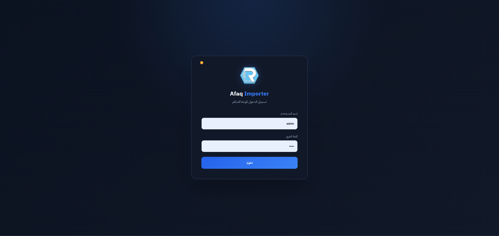
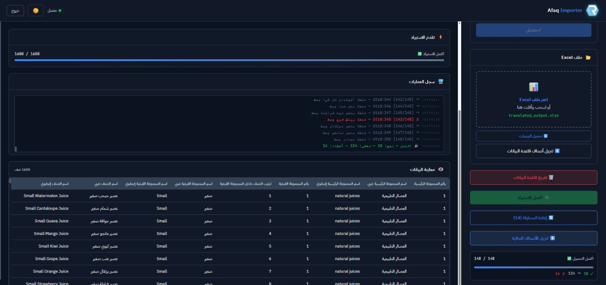
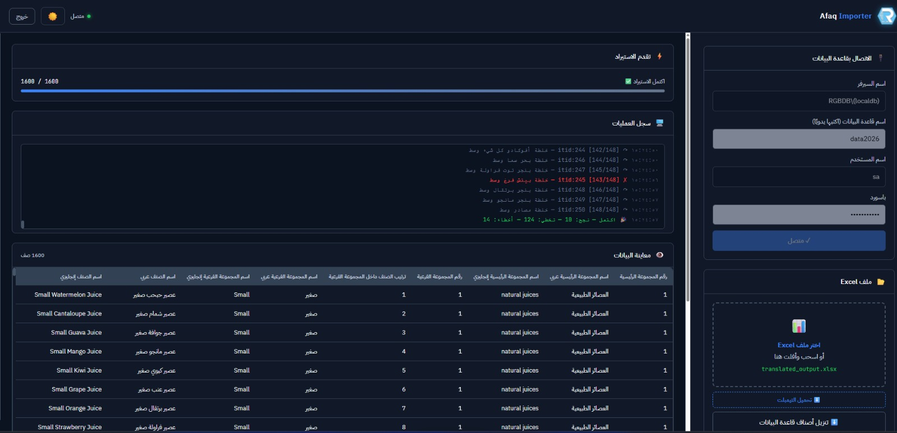

# 🚀 SQL Menu Bulk Importer

Professional Excel-to-SQL Server importer with real-time progress, automatic translation, menu hierarchy support, and bulk update capabilities.


---

## 📖 Overview

SQL Menu Bulk Importer is a web-based tool designed to simplify importing restaurant menu data from Excel into SQL Server databases.

It supports:

- Bulk menu updates
- Automatic Arabic → English translation
- Category and subcategory synchronization
- Product price updates
- Image downloading and optimization
- Secure login authentication
- Real-time import progress

The application is built with **Node.js**, **Express.js**, and **SQL Server** to provide a fast and reliable import workflow.

---

# ✨ Features

### 🔐 Authentication

- Secure login system
- Session-based authentication
- Protected application routes
- Logout support

---

### 📊 Excel Import

- Import large Excel files
- Automatic header detection
- Real-time validation
- Fast parsing using SheetJS (XLSX)

---

### 🌍 Automatic Translation

- Arabic → English translation
- Google Translate integration
- Intelligent translation cache
- Automatic transliteration fallback
- English text normalization

---

### 🍽 Menu Hierarchy Support

Supports updating:

- Main Categories
- Sub Categories
- Menu Items
- Prices

without changing existing database relationships.

---

### 🗄 SQL Server Integration

Supports:

- SQL Server
- SQL Server LocalDB

Connection testing before import.

---

### ⚡ High Performance

- Streaming progress updates (Server Sent Events)
- Batch processing
- Connection pooling
- Optimized SQL updates

---

### 🖼 Image Downloader

Automatically:

- Search product images
- Download images
- Resize
- Compress
- Save optimized copies

---

## 🛠 Tech Stack

### Backend

- Node.js
- Express.js
- Express Session
- Multer
- XLSX
- MSSQL
- Google Translate API

### Frontend

- HTML5
- CSS3
- JavaScript

### Database

- Microsoft SQL Server

---

# 📂 Project Structure

```text
.
├── server.js
├── index.html
├── login.html
├── login.css
├── theme.js
├── download-images.js
├── package.json
├── RGB_new4.png
├── uploads/
├── optimized/
└── translated_output.xlsx
```

---

# ⚙️ Installation

Clone the repository

```bash
git clone https://github.com/Mostafamahmoud12824/sql-menu-bulk-importer.git
```

Go to the project

```bash
cd sql-menu-bulk-importer
```

Install dependencies

```bash
npm install
```

Start the application

```bash
node server.js
```

Or

```bash
npm start
```

Development mode

```bash
npx nodemon server.js
```

---

# 🔑 Login

The application uses session-based authentication.

Configure your credentials inside:

```
server.js
```

Password is stored using **bcrypt hashing**.

---

# 🚀 Workflow

1. Login
2. Connect to SQL Server
3. Upload Excel File
4. Preview Data
5. Import Menu
6. Translate Items
7. Update Database
8. Download Images
9. Export Translated Excel

---

# 📸 Screenshots

You can add screenshots here.

Example:

```
screenshots/

login.png

dashboard.png

import.png

progress.png
```

Then include:

```markdown
## Login


## Dashboard


```

---

# 🔒 Security

- Session Authentication
- Protected Routes
- Password Hashing (bcrypt)
- Secure Middleware Ordering
- Unauthorized Access Prevention

---

# 📈 Performance

- Real-time progress
- Streaming updates
- Connection pooling
- Cached translations
- Bulk SQL updates

---

# 📦 Generated Files

The application may generate:

```
translated_output.xlsx
optimized/
uploads/
```

These files are created automatically during execution.

---

# 📄 Requirements

- Node.js 18+
- SQL Server
- npm
- Internet connection (for automatic translation and image download)

---

# 🤝 Contributing

Contributions are welcome.

1. Fork the repository
2. Create a feature branch

```bash
git checkout -b feature/my-feature
```

3. Commit your changes

```bash
git commit -m "Add new feature"
```

4. Push your branch

```bash
git push origin feature/my-feature
```

5. Open a Pull Request

---

# 📜 License

This project is licensed under the MIT License.

---

# 👨‍💻 Author

**Mostafa Mahmoud**

Software Engineer

- GitHub: https://github.com/Mostafamahmoud12824

---

screenshots/



